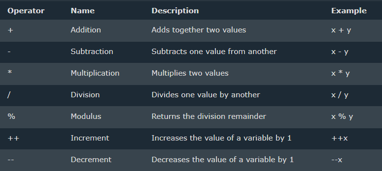

# OPERATORS

#### Operators are used to perform operations on variables and values.
### Example :
```java
public class Main {
  public static void main(String[] args) {
    int x = 100 + 50;
    System.out.println(x);
  }
}
```

#### Explaination: int x --> Result ; 100 --> Operand ; + --> Operator ; 50 --> Operand
---

## Types Of Operators
### Java divides the operators into the following groups:

- Arithmetic operators
- Assignment operators
- Comparison operators
- Logical operators
- Bitwise operators
---

## Arithmetic Operators
### Arithmetic operators are used to perform common mathematical operations.



---
### Examples
#### ADDITION
```java
public class Main {
  public static void main(String[] args) {
    int x = 5;
    int y = 3;
    System.out.println(x + y);
  }
}
```
#### OUTPUT : 8

#### SUBRACTION
```java
public class Main {
  public static void main(String[] args) {
    int x = 5;
    int y = 3;
    System.out.println(x - y);
  }
}
```
#### OUTPUT : 2

#### MULTIPLICATION
```java
public class Main {
  public static void main(String[] args) {
    int x = 5;
    int y = 3;
    System.out.println(x * y);
  }
}
```
#### OUTPUT : 15

#### DIVISION
```java
public class Main {
  public static void main(String[] args) {
    int x = 12;
    int y = 3;
    System.out.println(x / y);
  }
}
```
#### OUTPUT : 4

#### MODULUS
```java
public class Main {
  public static void main(String[] args) {
    int x = 5;
    int y = 2;
    System.out.println(x % y);
  }
}
```
#### OUTPUT : 1

#### INCREMENT
```java
public class Main {
  public static void main(String[] args) {
    int x = 5;
    ++x;
    System.out.println(x);
  }
}
```
#### OUTPUT : 6

#### DECREMENT
```java
public class Main {
  public static void main(String[] args) {
    int x = 5;
    --x;
    System.out.println(x);
  }
}
```
#### OUTPUT : 4

---

## Assignment Operators
### Assignment operators are used to assign values to variables.


