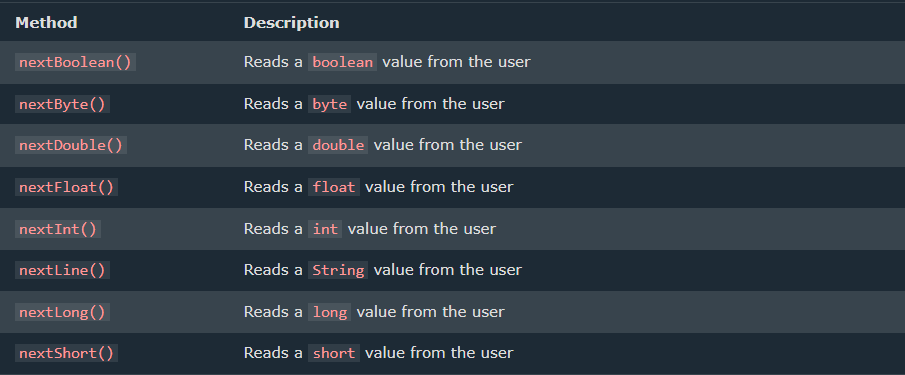

# UserInput
#### The Scanner class is used to get user input, and it is found in the java.util package.
#### This "Scanner sc = Scanner(System.in);" is to be written in the main class
- you may change the object ie. sc
- you may write whatever you want to.
#### This "import java.util.Scanner;" is to be written above the main class.
---
## Syntax
```java
import java.util.Scanner;
public class main{
    public static void main(String[] args) {
  Scanner sc = Scanner(System.in);
    }
}
```
## Input Types



## Example:
```java
import java.util.Scanner;

class Main {
  public static void main(String[] args) {
    Scanner myObj = new Scanner(System.in);

    System.out.println("Enter name, age and salary:");

    // String input
    String name = myObj.nextLine();

    // Numerical input
    int age = myObj.nextInt();
    double salary = myObj.nextDouble();

    // Output input by user
    System.out.println("Name: " + name);
    System.out.println("Age: " + age);
    System.out.println("Salary: " + salary);
  }
}
```
