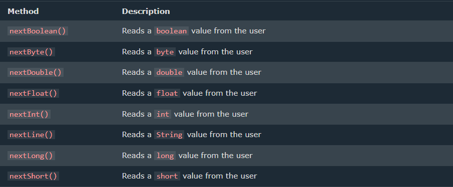

# UserInput
#### The Scanner class is used to get user input, and it is found in the java.util package.
#### This "Scanner sc = Scanner(System.in);" is to be written in the main class
- you may change the object ie. sc
- you may write whatever you want to.
#### This "import java.util.Scanner;" is to be written below the package and above the main class.
---
## Syntax
```java
package Main;
import java.util.Scanner;
public class main{
    public static void main(String[] args) {
  Scanner sc = Scanner(System.in);
    }
}
```
## Input Types

#### There are eight primitive data types in Java:



### Integer Types
### hjsd
