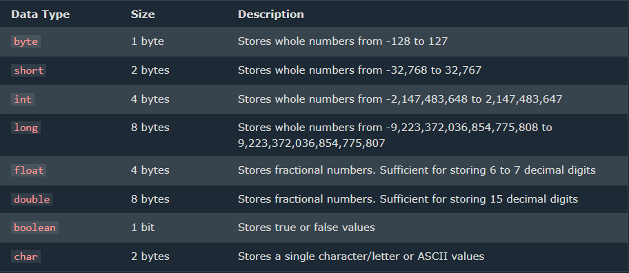

# Variables And Data Types
---
## Variables 

#### A variable is a container that stores the value
#### This value can be changed during the execution of the program
---
### Example
```java
 int number = 8;
```
#### int --> datatype  ,  number --> variable name  ,  8 --> value it stores
---
### Rules of Declaring a variable name
#### We can choose a name for declaring a Java variable if the following rules are followed:
- must not begin with a digit
  eg: int 1name; is invalid
- name is case sensitive
  eg: Aerika and aerika are different!
- should not be a keyword
  eg: void
- white space is invalid
  eg: int hello world;
---
## Data Types
#### Data Types in Java falls under the following categories
### 1. Primitive Data Types (Intrinsic)
### 2. Non-Primitive Data Types (Derived) 
---
## Primitive Data Types
#### A primitive data type specifies the size and type of variable values, and it has no additional methods.
#### Java is Statically Typed ... variables must be declared before use!
#### There are eight primitive data types in Java:



### Integer Types

- byte
  #### Example
  ```java
  byte myNum = 100;
  System.out.println(myNum);
  ```
  #### Output : 100
---
- short
  #### Example
  ```java
  short myNum = 5000;
  System.out.println(myNum);
  ```
  #### Output : 5000
 ---
- int
  #### Example
  ```java
  int myNum = 100000;
  System.out.println(myNum);
  ```
  #### Output : 100000
  ---
- long
  #### Example
  ```java
  long myNum = 15000000000L;
  System.out.println(myNum);
  ```
  #### Output : 15000000000
---
### Floating Point Types
- float
  #### Example
  ```java
  float myNum = 5.75f;
  System.out.println(myNum);
  ```
  #### Output : 5.75
  ---
- double
#### Example
```java
  double myNum = 19.99d;
  System.out.println(myNum);
```
#### Output : 19.99
---
### Boolean Types
- boolean
#### Example
```java
boolean isJavaFun = true;
boolean isFishTasty = false;
System.out.println(isJavaFun);     // Outputs true
System.out.println(isFishTasty);   // Outputs false
```
#### Output : true      false
---  
### Characters
- String
#### Example
```java
String greeting = "Hello World";
System.out.println(greeting);
```
#### Output : Hello World
---
- char
#### Example
```java
char myGrade = 'B';
System.out.println(myGrade);
```
#### Output : B 
---
